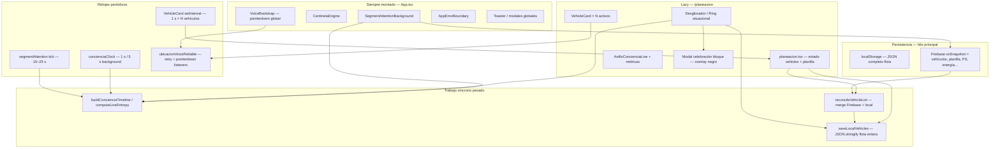

# Brief: bloqueo del hilo principal y congelamiento en móvil (Jornada / SISTEMICAR)

Documento para especialista externo. Estado: **problema crítico activo** (jun 2026).  
Producción: [sistemicar.app](https://sistemicar.app) · Repo: `proyecto-sistemicar` · Rama: `main`

---

## Resumen ejecutivo

SISTEMICAR experimenta **congelamiento del hilo principal** en dispositivos móviles. El síntoma escala desde «Jornada no abre» hasta **toda la app deja de responder** en el celular del operador.

No es un bug aislado de un botón ni de un modal: es un **conflicto estructural** entre varios motores que compiten por el mismo hilo (React + localStorage + Firebase + TTS + relojes de 1 s), concentrado en la ruta `/planeacion` (Jornada) y en el ciclo de vida del **desglosador situacional** (ring de enfoque real).

Se han aplicado **más de 8 deploys correctivos** en junio 2026. Cada uno mitigó un síntoma; **el bloqueo persiste o regresa** al cerrar desglosadores, al abrir Jornada con vehículos activos, o tras acumular sesión.

**Lo que necesitamos del especialista:** una **solución sistémica** (arquitectura / aislamiento de motores / presupuesto de main thread), no otro parche local en un `useEffect`.

---

## Síntomas reportados por el operador

| Fase | Comportamiento |
|------|----------------|
| Durante uso | Al cerrar desglosador situacional: freeze, pantalla negra, voz deja de responder |
| Tras deploys | Al intentar abrir Jornada: spinner eterno o pantalla negra |
| Escala | Tras varios intentos, **SISTEMICAR completo no responde** en el celular |
| Contraste | Laptop suele tolerar la carga; móvil (Lima, UTC-5) es donde falla de forma severa |

La pantalla negra puede ser:

1. **Overlay de celebración** del bloque situacional (`rgba(0,0,0,0.88)`, z-index 225)
2. **`AppErrorBoundary`** tras un error de render (crash React)
3. **Hilo principal bloqueado** sin crash: la UI no pinta ni responde a toques

Recuperación de emergencia existente: botones «Reparar y abrir Planificación» / «Cerrar ring de enfoque (emergencia)» en `app-error-boundary.tsx`.

---

## Cronología de intentos de corrección (jun 2026)

| Commit | Enfoque | Resultado reportado |
|--------|---------|---------------------|
| `2f412ab` | Alineación horaria Lima unificada | Resuelto desfase horario |
| `e87b5d1` | Dedup toasts entropía | Mitigó tormenta de toasts rojos |
| `3306911` | Catch-up por lotes, Firebase debounced, cache anillo | Mitigó bloqueo al abrir Jornada (parcial) |
| `deaf788` | Modo móvil: layout compacto, motores ligero, lazy Jornada | Laptop OK; móvil aún frágil |
| `80f82e6` | Voz TTS: desbloqueo con gesto, botón «Probar voz» | Voz recuperada en teoría; bloqueo persiste |
| `81e704e` | TTS idempotente, cierre desglosador diferido, persist debounced | Bloqueo al cerrar situacional sigue |
| `9c56f2a` | Import TTS roto, cleanup voz al desmontar, flota diferida | **Problema sigue activo** en celular |

**Conclusión interna:** los parches tratan **síntomas en puntos calientes**; no eliminan la **acumulación de trabajo síncrono** ni los **ciclos de feedback** entre capas.

---

## El «medio» conflictivo: arquitectura actual

SISTEMICAR no es una SPA simple: en cada sesión conviven **motores globales siempre activos** (incluso fuera de Jornada) más **Jornada**, un monolito de ~13 000 líneas en un chunk lazy de ~536 KB.



### Motores globales (no se apagan al salir de Jornada)

| Componente | Archivo | Qué hace en main thread |
|------------|---------|-------------------------|
| SegmentAttentionBackground | `SegmentAttentionBackground.tsx` | Tick entropía/puertas cada 10–25 s; `buildConcienciaTimeline`; notificaciones |
| CentinelaEngine | `centinela-engine.tsx` | Timer 120 s, reconcile Firestore |
| VoiceBootstrap | `App.tsx` | `unlockSpeechSynthesis` en cada `pointerdown` (mitigado parcialmente) |
| concienciaClock | `concienciaClock.ts` | Dispara re-render anillo cada 1 s (5 s en background) |
| Múltiples subscribers | `persistence.ts` | Doctor IA, historial, radar, cierre jornada, etc. llaman `saveLocalVehicles` |

### Jornada (`planeacion.tsx`) — punto de máxima densidad

- **~70 `useEffect`** en la página padre
- **`VehicleCard`** embebido en el mismo archivo: intervalos de 1 s por vehículo activo, voz situacional, alarmas de cupo, ring de inactividad, desglosador tiempo
- **`subscribeToVehicles`**: cada snapshot Firebase → `reconcileVehicleList` → `saveLocalVehicles` → `setVehicles` → recálculo de múltiples `useMemo` (termo, disciplina, anillo, combustible…)
- **Apertura lazy**: Suspense «Cargando Jornada…»; si el hilo se bloquea antes del primer paint, el usuario ve congelamiento total

### Desglosador situacional — disparador frecuente del freeze

Flujo al **cerrar bloque / ring**:

1. `setVehicles` (estado + ref)
2. `saveLocalVehicles` o debounce (serialización JSON de **toda la flota**)
3. `updateVehicle` Firebase (a veces varias veces seguidas)
4. `awardSovereigntyPoints`, toasts, chimes, `setGoldenFlash`
5. Modal celebración (Framer Motion, overlay negro fullscreen)
6. `armEntropyGapOnConsciousClose` → `buildConcienciaTimeline` (diferido con `requestIdleCallback`, pero sigue en cola)
7. Centinela / segment attention tick si queda hueco consciente
8. Voz: `ubicacionVoiceReliable` deja listeners `pointerdown` / `visibilitychange` si no hay cleanup (parcialmente corregido en `9c56f2a`)

Todo esto puede ocurrir **en el mismo instante** que el operador toca «Absorber victoria» (nuevo gesto → más handlers).

---

## Hipótesis sistémicas (priorizadas)

### H1 — Saturación del hilo principal por diseño (causa raíz probable)

Varios subsistemas asumen **CPU de laptop** y **localStorage rápido**. En móvil:

- `JSON.stringify` / `parse` de flota completa en cada reconcile
- `buildConcienciaTimeline` en ticks de 1 s + segment attention + cierre consciente
- Re-render en cascada: `vehicles` en deps de muchos `useMemo`

**Evidencia:** parches de defer/debounce alivian pero no eliminan el patrón «mucho trabajo síncrono en el mismo frame».

### H2 — Bucle de feedback Firebase ↔ localStorage ↔ React

Cadena observada:

```
Firebase snapshot → reconcileVehicleList → saveLocalVehicles → setVehicles
→ VehicleCard effects (sync anchor, voz) → updateVehicle → Firebase…
```

`saveLocalVehicles` tiene lógica defensiva que **preserva activos** si faltan en snapshot (`persistence.ts` ~921–951), lo cual es correcto para integridad pero **aumenta costo** y puede amplificar merges.

### H3 — Fuga de listeners / timers al ciclo de vida del vehículo (parcialmente confirmada)

El especialista sugirió `SpeechRecognition.stop()`. **Eso no aplica:** reconocimiento de voz solo existe en `/espejo`.  
Lo que sí aplica: **`ubicacionVoiceReliable`** registraba listeners globales por frase (`pointerdown`, `visibilitychange`, `focus`) y timers de retry. Sin cleanup al desmontar `VehicleCard`, se acumulan.

Corrección en `9c56f2a`: `cancelUbicacionVoiceForVehicle`, cleanup en unmount. **Problema persiste** → hay más fugas o el daño ya está hecho en sesiones largas.

### H4 — Error de runtime al abrir con vehículo situacional activo (confirmado y parcheado)

En `ubicacionVoiceReliable.ts`, `unlockSpeechSynthesis()` se llamaba **sin import**. Al montar efecto de voz del ring → `ReferenceError` → `AppErrorBoundary` (pantalla negra).  
Commit `9c56f2a` corrige el import. Si el celular sigue sin abrir, **H4 no explica todo**; convive con H1–H3.

### H5 — Chunk monolítico + hidratación de estado pesada al montar

- `planeacion-*.js` ≈ **536 KB** minificado (gzip ~138 KB)
- Init: `repairStuckSituacionVehicles()`, `getLocalVehicles()`, múltiples subscribes
- `flotaUiReady` (defer ~0,9–2,2 s) es un parche; el resto de la página sigue montando métricas pesadas

### H6 — Acumulación de sesión: memoria + localStorage + TTS del navegador

Tras varios intentos de abrir Jornada sin éxito:

- Crash count en `sessionStorage` (`sistemicar_planeacion_crash_count`)
- Posible **presión de memoria** en WebView móvil (Safari/Chrome Android)
- `speechSynthesis` en iOS puede quedar en estado corrupto tras muchos `speak()` / cancel

Resultado: **toda la app deja de responder**, no solo Jornada.

---

## Modo móvil ya implementado (insuficiente)

Archivo `mobilePerf.ts`:

| Constante | Valor móvil | Intento |
|-----------|-------------|---------|
| `ATTENTION_INITIAL_DEFER_MS` | 18 000 | No correr catch-up al abrir |
| `ATTENTION_TICK_MS` | 25 000 | Menos ticks entropía |
| `ANILLO_DEFER_MS` | 6 000 | Anillo pesado más tarde |
| `SKIP_RETRO_CENTINELA` | true | Menos trabajo centinela |

Detección: `isCoarseConcienciaDevice()` en `concienciaClock.ts` (pantalla táctil / viewport).  
**Sigue siendo reactivo**, no aísla motores ni reduce suscripciones duplicadas.

---

## Diagnóstico del informe externo (desmontaje / SpeechRecognition)

| Recomendación externa | Validez en SISTEMICAR |
|----------------------|------------------------|
| Cleanup en `useEffect` al desmontar desglosador | **Válida** — incompleta antes de `9c56f2a` |
| `recognition.stop()` / SpeechRecognition | **No aplica** a desglosador situacional |
| Cancelar `setInterval` / `rAF` | **Parcialmente hecha** — intervalos de UI sí; motores globales no |
| Auditar re-renders infinitos en padre | **Válida** — sospecha en sync anchor + Firebase echo |

La dirección correcta del especialista es **ciclo de vida y fugas**; el mecanismo concreto en este módulo es **TTS + listeners globales + timers**, no ASR.

---

## Archivos críticos para auditoría sistémica

| Archivo | Rol en el conflicto |
|---------|---------------------|
| `client/src/pages/planeacion.tsx` | Monolito Jornada + `VehicleCard` + cierres situacional |
| `client/src/lib/persistence.ts` | `saveLocalVehicles`, `subscribeToVehicles`, reconcile |
| `client/src/components/SegmentAttentionBackground.tsx` | Motor global entropía/puertas |
| `client/src/engines/ConcienciaEngine.ts` | `buildConcienciaTimeline`, `computeLiveEntropy`, `armEntropyGapOnConsciousClose` |
| `client/src/lib/ubicacionVoiceReliable.ts` | Voz ring/desglosador + listeners globales |
| `client/src/lib/speechQueue.ts` | Cola TTS, `unlockSpeechSynthesis` |
| `client/src/App.tsx` | VoiceBootstrap, lazy route, error boundary |
| `client/src/components/app-error-boundary.tsx` | Recuperación emergencia |
| `client/src/lib/anilloLiveModelCache.ts` | Cache anillo (bucket 3–6 s) |
| `client/src/lib/mobilePerf.ts` | Throttle móvil (insuficiente) |
| `client/src/lib/situacionRepair.ts` | Reparación vehículos atascados |

Documento relacionado (otro eje, ya estabilizado en tests): `BRIEF_ENTROPIA_RELOJ_ESPECIALISTA.md`.

---

## Protocolo de reproducción sugerido (~20 min)

Dispositivo: **celular real** (no solo DevTools), operador en Lima, cuenta con Jornada activa.

1. Tener **≥1 vehículo situación activo** con ring (`situacionCronometro.activo === true`) y subtareas en desglose.
2. Abrir [sistemicar.app/planeacion](https://sistemicar.app/planeacion) — anotar: ¿spinner?, ¿negro?, ¿cuántos segundos?
3. Completar y **cerrar bloque** del desglosador situacional → «Absorber victoria».
4. Repetir abrir/cerrar Jornada **3 veces** sin matar la pestaña.
5. Si la app entera deja de responder: anotar modelo SO, navegador, si PWA o Safari/Chrome.
6. Si aparece pantalla de error: copiar mensaje mono (`AppErrorBoundary`) y usar «Reparar y abrir Planificación».
7. Opcional dev: conectar Safari Web Inspector / Chrome remote debugging y capturar **Performance profile** de 30 s durante paso 2 y 3.

Datos útiles para el especialista:

- Tamaño de `localStorage` clave `sistemicar_vehicles` (bytes)
- Número de vehículos `status === "activo"`
- Si el freeze ocurre **antes** o **después** de montar VehicleCard
- Stack o error en consola (especialmente `ReferenceError`, `QuotaExceededError`)

---

## Preguntas abiertas para el especialista

1. ¿Conviene **extraer motores globales** (entropía, centinela, voz) a **Web Worker** o scheduler único con presupuesto de ms por frame?
2. ¿Debe `saveLocalVehicles` pasar a ** escritura incremental por vehículo** (IndexedDB / delta) en lugar de JSON completo?
3. ¿Cuál es la estrategia correcta para **Firebase + local-first** sin `setVehicles` en cada snapshot cuando la firma no cambió? (existe `vehiclesReactiveSignature`; ¿suficiente?)
4. ¿Se debe **desacoplar Jornada** en rutas/componentes lazy (`VehicleCard`, anillo, métricas) con **Suspense por sección**?
5. ¿Hay un patrón recomendado para **TTS en iOS WebView** que no registre listeners globales por utterance?
6. ¿El monolito `planeacion.tsx` debe dividirse **antes** de seguir parcheando comportamiento?

---

## Propuesta de solución sistémica (borrador para validar)

No implementada aún; dirección que el equipo espera del especialista:

### Capa A — Scheduler único de conciencia

Un solo `requestAnimationFrame` / `requestIdleCallback` coordinator que serialice:

- tick entropía
- tick anillo
- catch-up segment attention  
Con **tope de ms por frame** y cola (no paralelo en 4 motores).

### Capa B — Persistencia fuera del hot path

- Debounce global de `saveLocalVehicles` (500 ms) con flush en `visibilitychange` / cierre vehículo
- No escribir localStorage desde **cada** subscriber Firebase si la firma es igual
- Considerar IndexedDB para flota grande

### Capa C — Ciclo de vida estricto del desglosador situacional

- Contexto `SituacionRingSession` con **una** instancia de timers/voz/listeners
- Al cerrar bloque: `teardown()` imperativo antes de cualquier celebración UI
- Prohibir listeners `pointerdown` globales por frase; un solo canal de retry por app

### Capa D — Jornada cargable en móvil

- Split: shell ligero (segmentos + lista IDs) → cards pesados en idle
- Métricas / anillo en tab separado lazy (`planTab === "metricas"`)
- Kill switch: «modo supervivencia» que desactiva voz + anillo live + catch-up

### Capa E — Observabilidad

- Panel `?debug=perf` con: ms por tick, tamaño flota, listeners activos, último `saveLocalVehicles`
- Similar a `?debug=entropia` ya existente

---

## Criterio de éxito

1. Abrir Jornada en celular con vehículo situacional activo: **< 3 s** hasta UI usable, sin pantalla negra.
2. Cerrar desglosador situacional: **sin freeze > 500 ms** perceptible; voz sigue operativa o se silencia limpio.
3. Tras 5 ciclos abrir/cerrar Jornada: **app sigue respondiendo** en menú y otras rutas.
4. Solución documentada como **arquitectura**, no lista de parches dispersos.

---

## Contacto interno

- Operador afectado: Gilson (Lima, UTC-5)
- Entorno producción: Netlify → `sistemicar.app`
- Último commit desplegado al redactar: `9c56f2a` — *actualizar si hay deploy posterior*

---

*Documento generado para handoff a especialista. Actualizar sección «Cronología» y «Último commit» tras cada deploy.*
