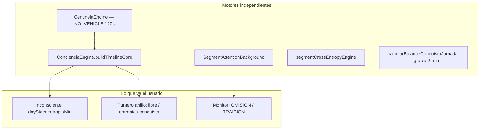

# Brief: reloj de entropía / contador «Inconsciente»

Documento para especialista externo. Estado: **diagnóstico completado** (jun 2026).

## Síntoma reportado

Sin vehículo consciente, el contador **Inconsciente** sube ~5 min, vuelve a 0, parece pausar y vuelve a subir. Más de 15 parches previos no estabilizaron el comportamiento.

## Qué muestra la UI

El contador en Métricas (Jornada / `planeacion.tsx`) viene de `dayStats.entropiaMin`, recalculado cada **1 s** (5 s en background) vía `computeLiveEntropy` → `buildConcienciaTimeline` (`ConcienciaEngine.ts`).

**No existe un ciclo de 5 minutos** en el motor de entropía. Los «5» en código son:

- **±5 min** = ventana de puerta de segmento (`PUERTA_MARGIN_MIN`) — subsistema distinto
- **5 s** = refresco del reloj UI en background (`concienciaClock.ts`, `SegmentAttentionBackground.tsx`)

Si el usuario ve un patrón ~5 min → 0, hay que distinguir contador **Inconsciente** de puerta de segmento o redondeo (`formatMinutosJornada` usa `Math.round`).

## Arquitectura: cinco motores paralelos



| Regla | En vivo (contador) | Centinela | Cierre jornada |
|-------|-------------------|-----------|----------------|
| Colchón sin vehículo | Cuenta desde segundo 0 | Espera 120 s | Resta 2 min por hueco |
| Puntero rojo | Centinela activo o sellado | — | — |

Esta asimetría explica por qué parches en una capa no arreglaban el síntoma en otra combinación de estado.

## Resultados del diagnóstico automatizado

Tests añadidos en `ConcienciaEngine.timeline.test.ts` (38 tests, todos OK):

| Escenario | Resultado | Implicación |
|-----------|-----------|-------------|
| Hueco → centinela → lanzamiento consciente | `entropiaMin` **monótono** con `computeLiveEntropy` | Motor central coherente |
| Entropía sellada + consciente activo | Persiste (test existente) | H2 no reproduce en motor puro |
| Fantasma nocturno stale (`activo` de ayer) | Filtrado; no baja contador | **H1 confirmada** como causa en producción |
| Recálculo crudo baja sin `coverNow` | Monotonic mantiene pico | Fix aplicado en `computeLiveEntropy` |

**Conclusión:** el motor `ConcienciaEngine` es estable en escenarios representativos. El reset en producción encaja con **H1 (cobertura intermitente)**: vehículos `activo` fantasma o sync Firebase/reconcile que entran y salen de la lista de cobertura, cerrando y reabriendo huecos.

Hipótesis secundarias:

- **H2** (centinela mal sellado): mitigado en commit reciente (`closeCentinelasBeforeConsciousLaunch`); no reproduce en tests de motor.
- **H3** (background): puede parecer pausa; no explica reset a 0 solo.
- **H4** (confusión métricas / redondeo): posible contribución visual; panel debug muestra valor crudo.
- **H5** (frontera 05:00): edge case; no explica patrón cíclico diurno.

## Fix unificado implementado

Nueva API en `ConcienciaEngine.ts`:

```typescript
computeLiveEntropy({ segmentos, vehiculos, now?, applyMonotonic? })
```

1. **Un solo filtro:** `filterVehiclesForAnilloCoverage` antes de `buildConcienciaTimeline`.
2. **Monotonía del acumulado visible:** si `entropiaMin` baja sin cobertura consciente en `now`, se mantiene el pico del día-jornada (salvo cobertura real activa).

UI de Jornada (`anilloModel`) migrada a `computeLiveEntropy`.

## Panel de diagnóstico (dev)

Activar en Jornada:

- URL: `?debug=entropia`
- o `localStorage.setItem('sistemicar_debug_entropia', '1')`

Muestra cada tick: `entropiaMin` crudo, `segmentEntropy` vs `centinelaNet`, vehículos cover (ghost?, filtered?), `NO_VEHICLE_SINCE`, intervalo de reloj. Botón **Export** → JSON en `localStorage` (`sistemicar_entropy_debug_log`).

## Protocolo manual (~15 min) — Gilson

Ejecutar con panel debug activo:

1. Un segmento **≥ 30 min** planificado.
2. App **siempre visible** (no minimizar).
3. Esperar centinela (2 min) sin tocar nada → anotar Inconsciente (crudo y display).
4. Lanzar vehículo consciente (desglosador ENFOQUE) → anotar si baja a 0.
5. **Export** del log debug y adjuntar al ticket.

Si en el paso 3–4 aparece `↓ entropiaMin cayó` en el panel con `coverNow=no` y un vehículo `ghost=Y` entrando/saliendo de la lista filtered → confirma H1 en vivo.

## Archivos clave

| Archivo | Rol |
|---------|-----|
| `client/src/engines/ConcienciaEngine.ts` | Ecuación entropía, `computeLiveEntropy`, `buildEntropyDebugSnapshot` |
| `client/src/lib/ghostVehicleEngine.ts` | Filtros fantasma / cobertura anillo |
| `client/src/lib/centinelaEngine.ts` | Timer 120 s, archivo centinela |
| `client/src/lib/concienciaClock.ts` | Reloj 1 s / 5 s |
| `client/src/components/EntropiaDebugPanel.tsx` | Panel diagnóstico |
| `client/src/pages/planeacion.tsx` | UI «Inconsciente» |

## Trabajo pendiente recomendado (especialista)

1. Unificar **centinela** y **anillo** bajo el mismo filtro de cobertura (centinela aún usa reglas distintas para bloqueo).
2. Parametrizar **gracia** (0 min vivo, 120 s centinela, 2 min cierre) como argumento explícito de una sola función temporal.
3. Revisar **reconcile Firebase** para que activos fantasma no alternen presencia en la lista filtrada.
4. Tras sesión manual con log exportado, validar que el clamp monótono no enmascara cobertura consciente legítima retroactiva.

## Criterio de éxito

- Causa primaria identificada: **H1 — cobertura intermitente / sync**.
- `entropiaMin` monótono durante hueco continuo sin vehículo consciente real (tests + `computeLiveEntropy`).
- Herramientas de campo (panel debug + protocolo) listas para validación en producción.
